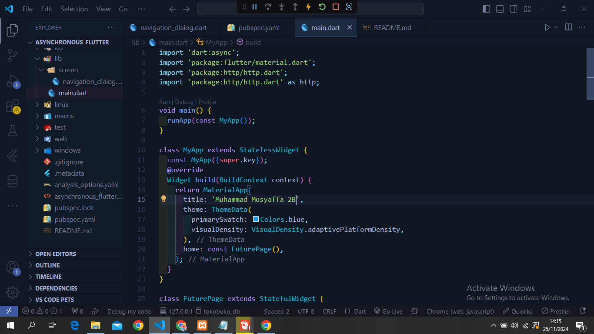
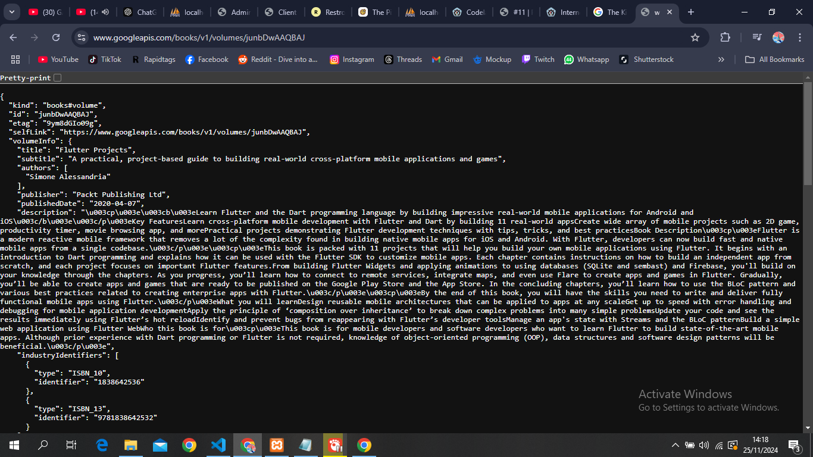
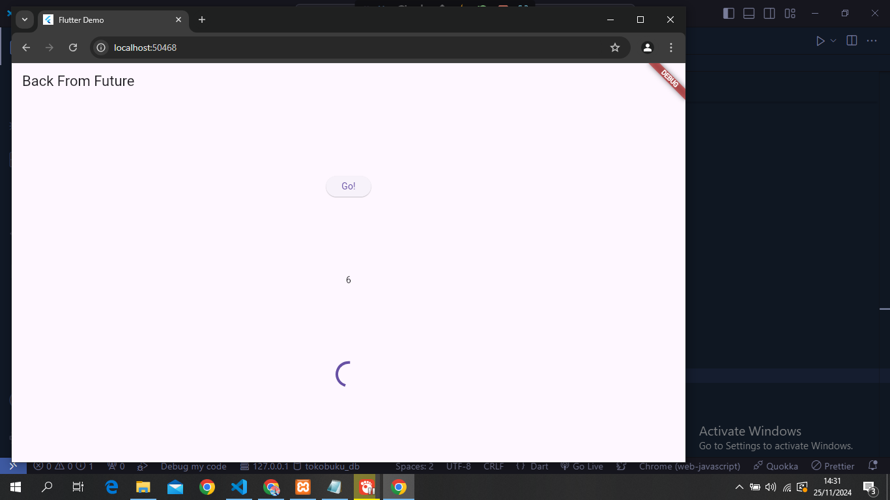
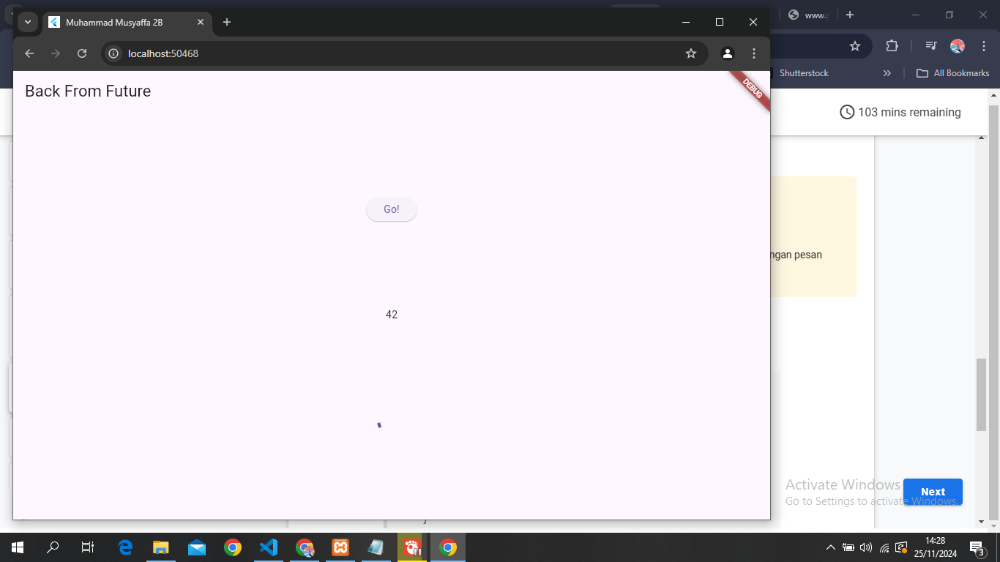
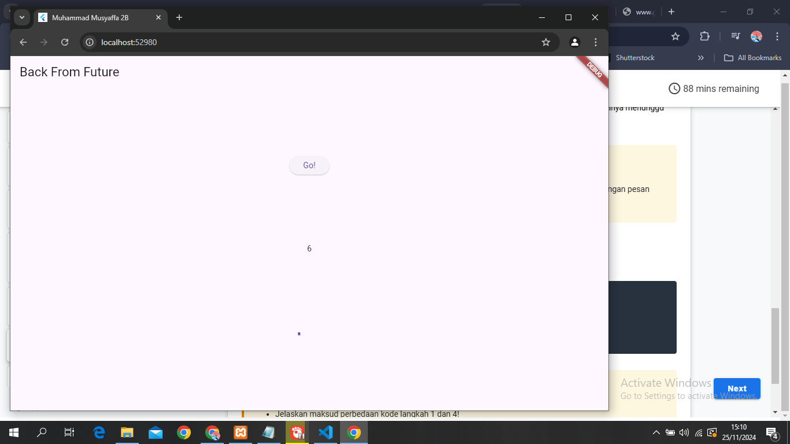
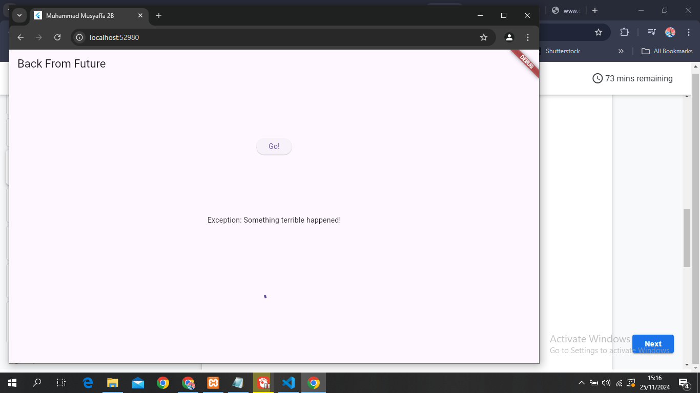
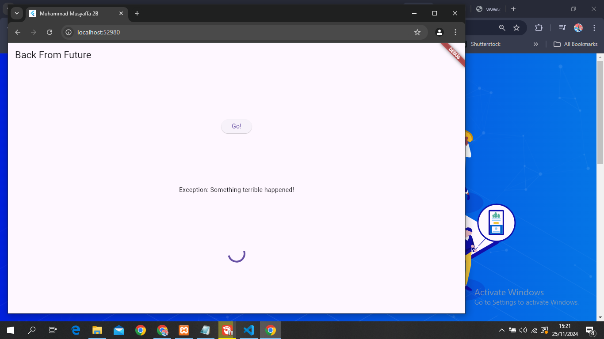

Praktikum Asynchronous

Praktikum 1

1. Identitas
   

2. Buku Favorit mengambil dari google books
   

3. Jelaskan maksud kode langkah 5 tersebut terkait substring dan catchError!

Fungsi substring() dan catchError() bekerja untuk memastikan aplikasi tetap berjalan dengan baik meskipun terjadi kesalahan saat mengambil data dari API

4. Hasil Praktikum
   

Jelaskan maksud kode langkah 1 dan 2 tersebut!
menunjukkan cara dasar melakukan operasi asinkron dalam Dart, khususnya dengan menggunakan Future dan async/await

5. Hasil Praktikum
   

Jelaskan maksud kode langkah 2 tersebut!
Konsep Completer memberikan cara yang lebih canggih untuk mengelola operasi asinkron dalam Dart

6. kontrol yang sangat granular
   Completer digunakan untuk kontrol yang sangat granular. jika perlu mengembalikan nilai setelah operasi maka pendekatan yang lebih sederhana seperti pada langkah 5-6

7. Praktikum 4 Hasil
   

8. Jelaskan maksud perbedaan kode langkah 1 dan 4!
   Future.wait() sangat berguna untuk meningkatkan kinerja dan efisiensi ketika menjalankan beberapa operasi asinkron secara paralel

9. Praktikum 5 Hasil

Method handleError

Panggil method handleError() tersebut di ElevatedButton, lalu run. Apa hasilnya? Jelaskan perbedaan kode langkah 1 dan 4!

Dengan menambahkan fungsi handleError(), kita telah membuat aplikasi menjadi lebih robust dan dapat menangani error dengan baik.

